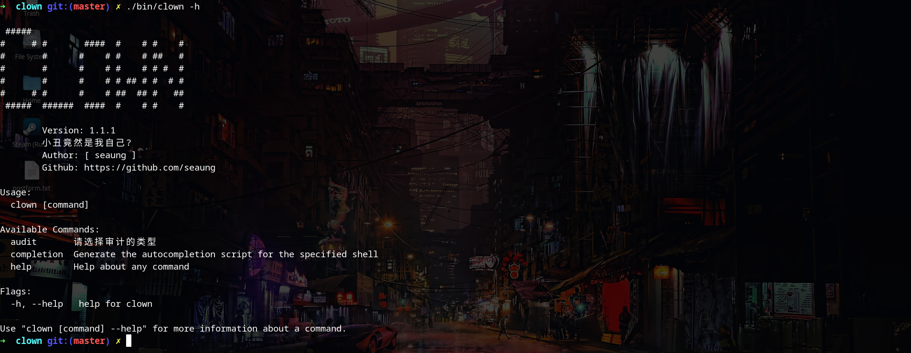
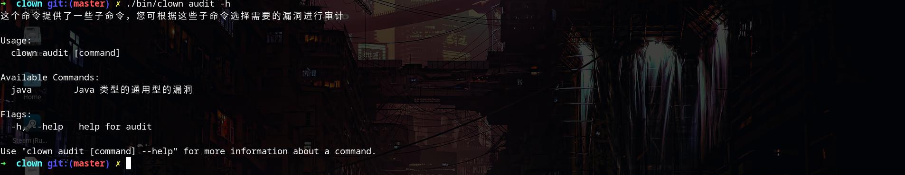
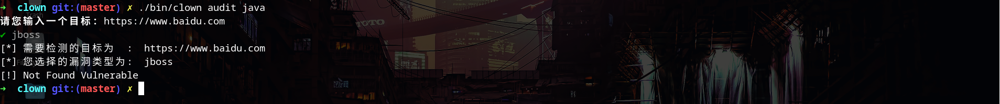

#### 简介
Clown直译为小丑,没错小丑竟然是我自己(哈哈哈)

Clown是一款交互式命令行漏洞验证工具,意在为不懂技术的人员提供一种简便漏洞验证方式


#### 项目目前基本结构
```bash
.
├── bin # 编译好的二进制文件
│   └── clown
├── cmd
│   └── clown.go
├── go.mod
├── go.sum
├── pic
│   └── clown.cast
├── pkg
│   ├── cmd # 执行命令
│   │   ├── audit.go
│   │   ├── java.go
│   │   ├── prompt.go
│   │   └── root.go
│   └── plugins # 专门放置漏洞插件
│       └── plugins.go
└── README.md

```


#### 展示






#### TODO

~~连半成品都不是的东西 2020.10.03~~

- [ ] 2022.03.12, 架子基本搭好


---
that's all
